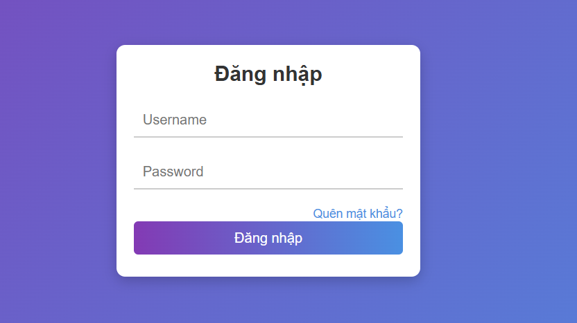
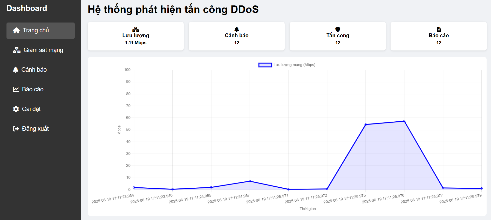
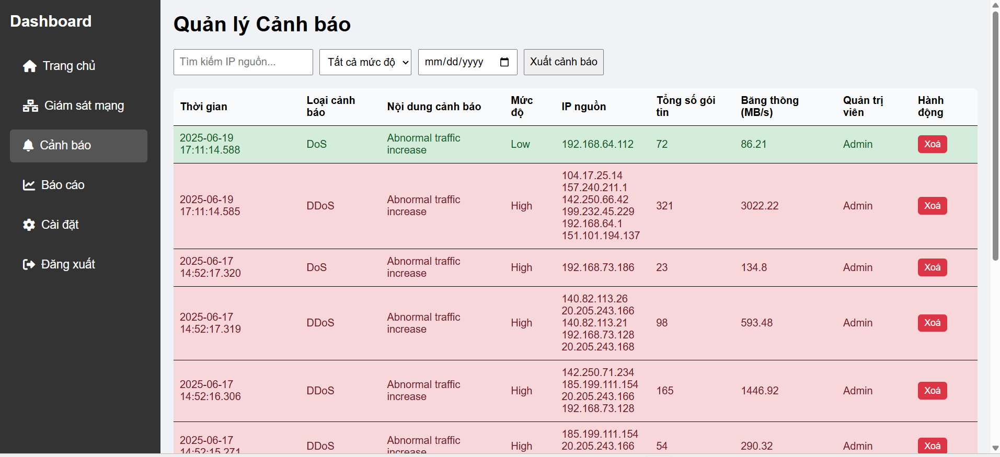
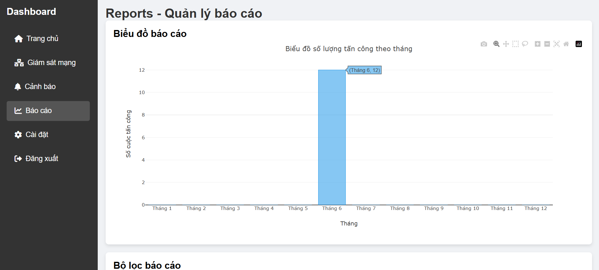
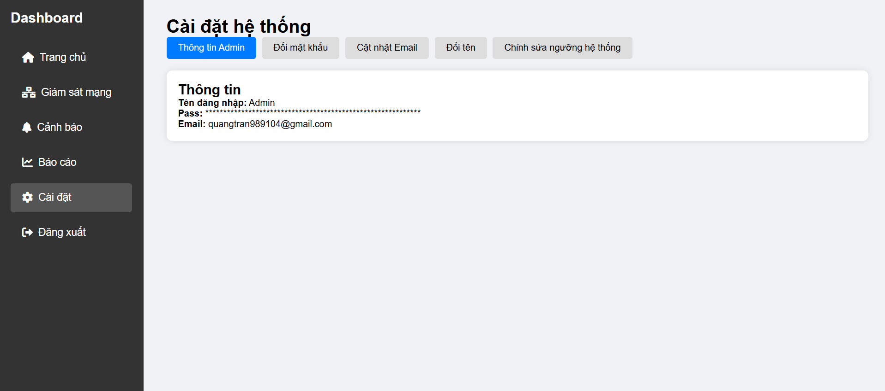
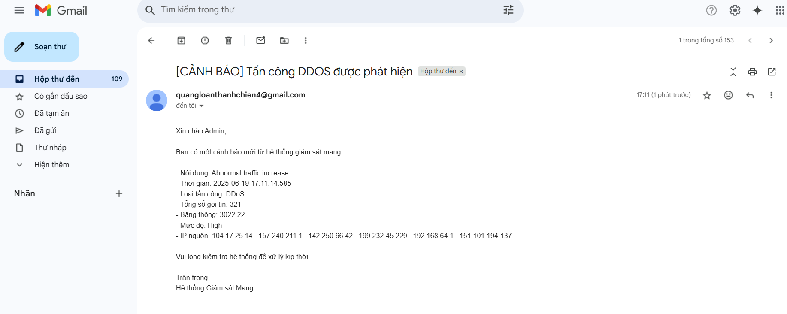

DDoS Attack Detection Software

Giới thiệu:
Đây là phần mềm phát hiện tấn công **DDoS (Distributed Denial of Service)**, được phát triển nhằm phục vụ 
đề tài môn học. Phần mềm sử dụng các thuật toán phân tích gói tin và phân tích lưu lượng mạng để 
phát hiện các hành vi bất thường gây ra bởi tấn công DDoS.

Mục tiêu:
- Thu thập và xử lý dữ liệu lưu lượng mạng
- Áp dụng các kỹ thuật phân tích theo ngưỡng để phát hiện tấn công DDoS
- Phân loại tấn công DoS/DDoS
- Giao diện thân thiện giúp dễ dàng giám sát lưu lượng mạng và cảnh báo theo thời gian thật.
- Có thể mở rộng và tích hợp trong môi trường mạng thực tế

Công nghệ sử dụng:
 Thành phần       | Công nghệ                
------------------|--------------------------
 Ngôn ngữ chính   | Python, Javascript                   
 Giao diện        | HTMS/CSS                     
 Bắt gói tin      | Scapy / Tshark / NCAP    
 Cơ sở dữ liệu    | SQLite3                               
 Đồ thị trực quan | chartjs, ploty 

 SETTING: 
 1. Cài đặt thư viện cần thiết: pip install -r requirements.txt
    
 2. Cài đặt NCAP
    
 3. Khởi động server FastAPI:
    uvicorn app:app --reload

 4. Truy cập giao diện:
  http://127.0.0.1:8000/

 5. Đăng nhập tài khoản:
    Username: Admin
    Password: 123

 6. Chạy file detect_ddos.py phân tích gói tin:
    python detect_ddos.py

DEMO:

 
